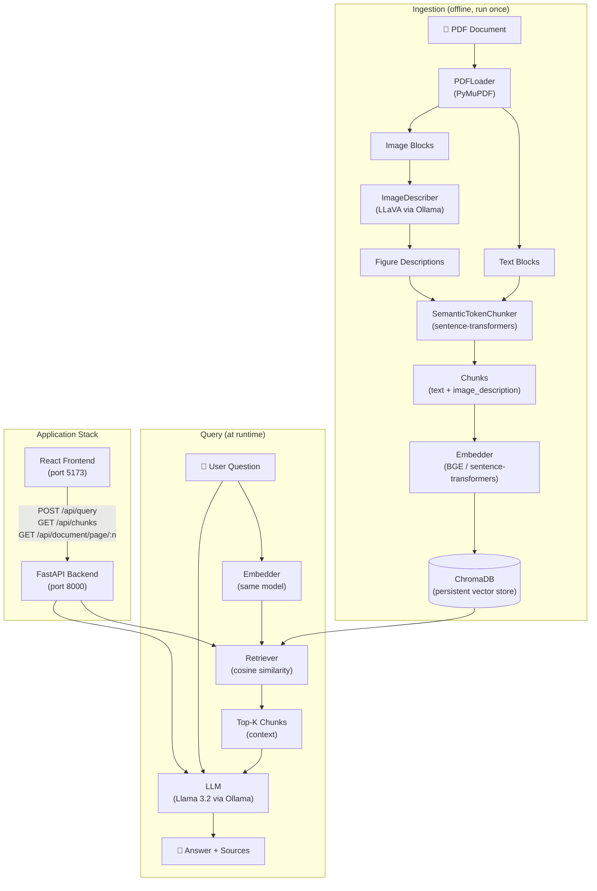

# RAG on IPCC Report

A fully local Retrieval-Augmented Generation (RAG) system that lets you query long PDF documents through a conversational interface — no cloud API required. Built and tested on **macOS with Apple Silicon (M-series)**, it runs comfortably on consumer hardware using lightweight open-source models served by Ollama.

Although this repository is wired for the **IPCC AR6 Synthesis Report**, the architecture is entirely document-agnostic: swap the PDF, adjust the config, re-run the vectorisation script, and the same pipeline works for any long-form document (legal contracts, technical manuals, academic papers, annual reports, etc.).

---

## Table of Contents

1. [Project Overview](#1-project-overview)
2. [How It Works](#2-how-it-works)
3. [How to Run](#3-how-to-run)

---

## 1. Project Overview

### What this project does

- **Ingests** any PDF document: extracts text blocks and figures page by page.
- **Describes figures** automatically using a local multimodal LLM (LLaVA), so images become searchable text alongside the prose.
- **Chunks** the extracted content using a semantic, token-aware algorithm that respects topic boundaries rather than slicing at arbitrary character counts.
- **Vectorises** all chunks with a local sentence-transformer embedding model and stores them in a persistent ChromaDB database.
- **Answers questions** by retrieving the most relevant chunks and passing them as context to a local LLM (Llama 3.2 by default), which generates a grounded, page-cited answer.
- **Exposes everything** through a FastAPI backend and a React/TypeScript frontend with two views:
  - **Ask Your Doc** — ask a question, read the answer, and inspect the source chunks alongside the rendered PDF pages with highlighted text.
  - **Vector Store** — browse every indexed chunk with its metadata (page, type, token count, similarity score).

### Why it works well on lightweight hardware

All inference runs locally via Ollama. The default models (`llama3.2` for text generation, `BAAI/bge-large-en-v1.5` for embeddings, `llava:13b` for image description) are selected to balance quality and memory footprint on an Apple Silicon machine. The MPS backend is used for embedding, which significantly speeds up vector generation compared to CPU.

### Reusability

To adapt this project to a different document:

1. Drop your PDF into `input_document/` and update `input_document` in `backend/config/config.py`.
2. Adjust the LLM system prompt in `backend/generation/llm.py` to match your domain.
3. Re-run the vectorisation script (`python scripts/vectorize_document.py --reset`).
4. Launch the app — done.

---

## 2. How It Works

### Architecture overview



### Component breakdown

**Ingestion pipeline** (`scripts/vectorize_document.py`)

The vectorisation runs as a one-off script in four steps:

1. **PDF loading** — `PDFLoader` (PyMuPDF) extracts text blocks from every page, normalising hyphenated line-breaks and whitespace. Images larger than 8 KB and 100×100 px are also extracted along with their surrounding text and an auto-detected figure label (e.g. `Figure 2.3`, `Box 4.1`).

2. **Figure description** — `ImageDescriber` sends each image to LLaVA (via Ollama) with a domain-specific system prompt. The generated description is treated as a regular text chunk, making figures fully searchable by semantic similarity.

3. **Semantic chunking** — `SemanticTokenChunker` splits text into sentences, encodes them with the embedding model, and opens a new chunk when either the token budget (`max_tokens_per_chunk = 512`) is exceeded or the cosine similarity between consecutive sentences drops below a threshold (`0.45`), signalling a topic boundary. A token overlap (`chunk_overlap_tokens = 64`) is prepended to each new chunk to preserve continuity.

4. **Embedding + storage** — All chunks are encoded in batches by the `Embedder` (BGE-large-en-v1.5 by default, running on MPS) and inserted into a persistent ChromaDB collection with full metadata (page number, chunk type, figure label, token count, source filename).

**RAG pipeline** (`backend/pipeline.py`)

At query time, `RAGPipeline` orchestrates:

- **Retrieval** — the user question is embedded with the same model (plus a BGE query prefix) and compared against the ChromaDB collection by cosine similarity. The top-K chunks (default 6) are returned, with optional filtering to exclude image descriptions.
- **Prompt assembly** — chunks are formatted into a structured context block with page-number headers and fed into the RAG prompt template alongside the question.
- **Generation** — `LLM` sends the prompt to Ollama (`llama3.2`, temperature 0.1) and returns the answer. The model is instructed to cite page numbers and to refuse to fabricate information not present in the context.

**FastAPI backend** (`backend/api/`)

Three routers are registered under `/api`:

| Endpoint | Description |
|---|---|
| `POST /api/query` | Run the full RAG pipeline; returns answer + source chunks |
| `GET /api/chunks` | Return every indexed chunk (for the Vector Store view) |
| `GET /api/document/page/{n}` | Render PDF page N as a PNG (with optional text highlight) |
| `GET /api/health` | Liveness check |

The pipeline (embedding model + ChromaDB connection + Ollama client) is initialised once at startup via FastAPI's lifespan mechanism and shared across all requests.

**React frontend** (`frontend/`)

Built with React 19 + TypeScript + Vite. Two views:

- **Ask Your Doc** — text input, answer display, collapsible source-chunk cards that render the corresponding PDF page (PNG from the backend) with the chunk text highlighted in yellow.
- **Vector Store** — paginated table of all indexed chunks with metadata for transparency and debugging.

The API base URL can be overridden via the `VITE_API_BASE` environment variable for non-local deployments.

### Key configuration (`backend/config/config.py`)

| Parameter | Default | Description |
|---|---|---|
| `embedding_model` | `BAAI/bge-large-en-v1.5` | HuggingFace embedding model |
| `embedding_device` | `mps` | `cpu` \| `cuda` \| `mps` |
| `llm_model` | `llama3.2` | Ollama text generation model |
| `multimodal_model` | `llava:13b` | Ollama multimodal model for figures |
| `max_tokens_per_chunk` | `512` | Hard token ceiling per chunk |
| `chunk_overlap_tokens` | `64` | Overlap between consecutive chunks |
| `semantic_similarity_threshold` | `0.45` | Cosine similarity below which a new chunk starts |
| `top_k` | `6` | Number of chunks retrieved per query |
| `temperature` | `0.1` | LLM temperature (low = factual) |

---

## 3. How to Run

### Prerequisites

- Python 3.12+
- Node.js 18+ and npm
- [Ollama](https://ollama.com) installed

### Step 1 — Clone the repository

```bash
git clone https://github.com/your-username/RAG_on_IPCC_Report.git
cd RAG_on_IPCC_Report
```

### Step 2 — Create the Python virtual environment

```bash
python3 -m venv .venv
source .venv/bin/activate       # Windows: .venv\Scripts\activate
pip install -r requirements.txt
```

### Step 3 — Install and configure Ollama models

Install Ollama from [https://ollama.com](https://ollama.com), then pull the two required models:

```bash
# Text generation model (used at query time)
ollama pull llama3.2

# Multimodal model (used during vectorisation to describe figures)
ollama pull llava:13b
```

> **Note:** `llava:13b` requires ~8 GB of RAM/VRAM. If your machine is constrained, you can use `llava:7b` instead — update `multimodal_model` in `backend/config/config.py` accordingly, or skip image description entirely with `--skip-images`.

### Step 4 — Create the required directories

```bash
mkdir -p db input_document logs images_cache
```

### Step 5 — Add your PDF

Place your PDF in the `input_document/` folder. By default the system expects:

```
input_document/IPCC_AR6_SYR_FullVolume.pdf
```

To use a different file, either rename it to match the default or update `input_document` in `backend/config/config.py`.

### Step 6 — Configure the embedding device

Open `backend/config/config.py` and set `embedding_device` to match your hardware:

```python
embedding_device: str = "mps"   # Apple Silicon
# embedding_device: str = "cuda"  # NVIDIA GPU
# embedding_device: str = "cpu"   # CPU fallback
```

### Step 7 — Configure the React frontend

```bash
cd frontend
npm install
cd ..
```

The frontend proxies API calls to `http://localhost:8000` by default. To override, create a `frontend/.env.local` file:

```env
VITE_API_BASE=http://localhost:8000
```

### Step 8 — Vectorise the document

This step needs to be run **once** (or again with `--reset` whenever you change the PDF or chunking parameters). Make sure Ollama is running first (`ollama serve`), then:

```bash
# Full vectorisation (text + figures)
python scripts/vectorize_document.py

# Faster — skip figure description (no image chunks)
python scripts/vectorize_document.py --skip-images

# Re-index from scratch, dropping the existing collection
python scripts/vectorize_document.py --reset

# Test run on the first 20 pages only
python scripts/vectorize_document.py --pages 20 --skip-images

# Custom PDF path
python scripts/vectorize_document.py --pdf /path/to/your/document.pdf
```

The script prints progress for each of the four steps (load → describe → chunk → embed+store) and reports the total number of chunks inserted into ChromaDB.

### Step 9 — Launch the application

The `app.sh` script starts all three services (Ollama if not already running, the FastAPI backend, and the React frontend) in one command:

```bash
chmod +x app.sh   # first time only
./app.sh
```

Logs for each service are written to the `logs/` directory:

```
logs/ollama.log
logs/backend.log
logs/frontend.log
```

Once everything is up, open your browser:

| Service | URL |
|---|---|
| **Frontend (UI)** | http://localhost:5173 |
| **Backend API** | http://localhost:8000 |
| **Interactive API docs** | http://localhost:8000/docs |

Press `Ctrl+C` to stop all processes cleanly.

### Folder structure (after setup)

```
RAG_on_IPCC_Report/
├── backend/
│   ├── api/            # FastAPI app and route handlers
│   ├── config/         # Centralised config (models, paths, hyperparameters)
│   ├── generation/     # LLM wrapper (Ollama)
│   ├── ingestion/      # PDF loader, image describer, semantic chunker
│   ├── models/         # Pydantic / dataclass models
│   ├── retrieval/      # Embedder, VectorStore (ChromaDB), Retriever
│   └── pipeline.py     # End-to-end RAGPipeline class
├── frontend/           # React + TypeScript + Vite
├── scripts/
│   ├── vectorize_document.py   # Ingestion entry point
│   └── test_query.py           # Quick CLI query test
├── db/                 # ChromaDB persistent storage (auto-created)
├── input_document/     # Place your PDF here
├── images_cache/       # Extracted figure cache (auto-created)
├── logs/               # Runtime logs (auto-created)
├── requirements.txt
└── app.sh              # One-command launcher
```
